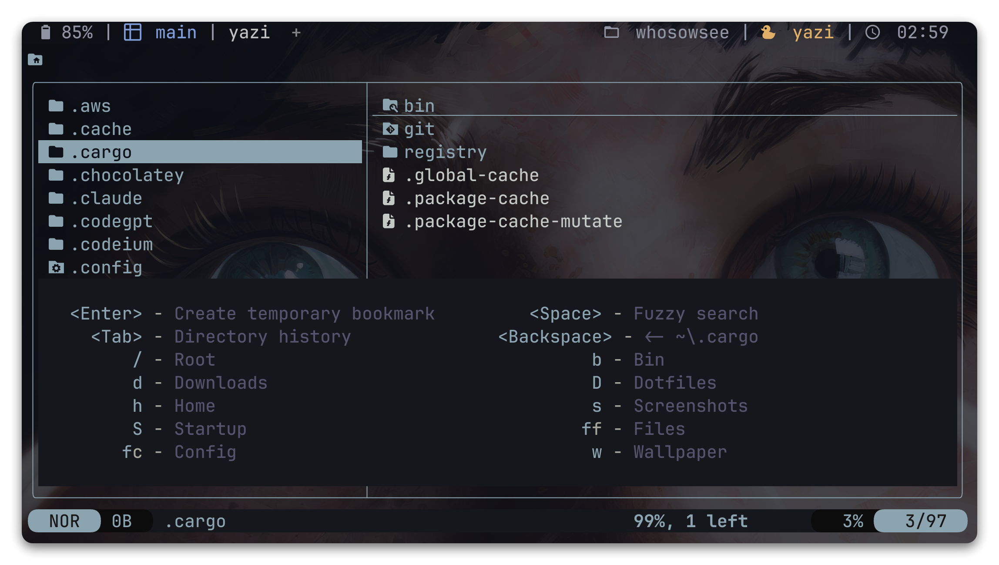
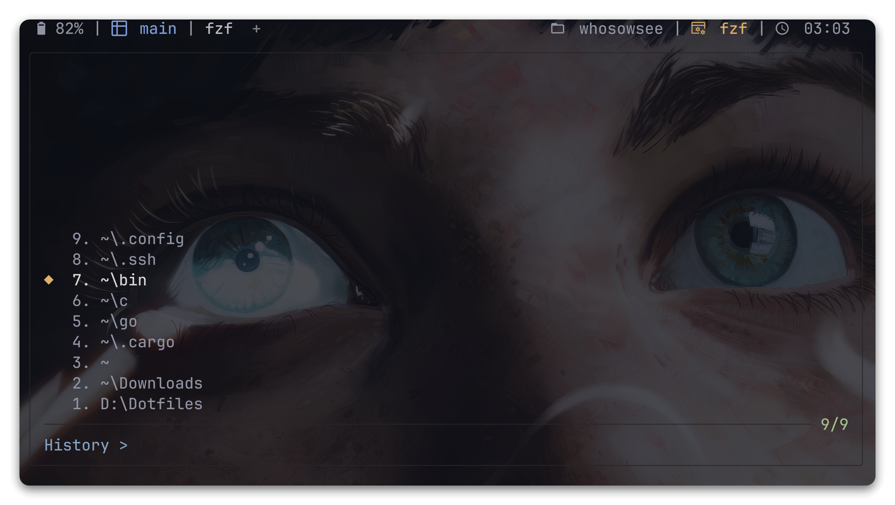

<h1 align="center">🌀 whoosh.yazi</h1>
<p align="center">
  <b>Молниеносный менеджер закладок для <a href="https://github.com/sxyazi/yazi">Yazi</a></b><br>
  <i>Сохраняйте, ищите и мгновенно переходите к любимым путям</i>
</p>

---
> [!TIP]
> **Английская версия:** [README.md](README.md)

> [!NOTE]
> Плагин для [Yazi](https://github.com/sxyazi/yazi) для управления закладками, поддерживающий следующие функции:
>
> - **Постоянные закладки** - Закладки не теряются после закрытия yazi
> - **Временные закладки** - Закладки только для текущей сессии, не сохраняются между перезапусками
> - **Быстрая навигация** - Переход, удаление и переименование закладок по горячим клавишам
> - **Нечеткий поиск** - Поддержка нечеткого поиска через [fzf](https://github.com/junegunn/fzf) с контекстными промптами
> - **Множественное удаление закладок** - Выбор нескольких закладок с помощью TAB в fzf
> - **Конфигурационные закладки** - Предварительная настройка закладок с помощью языка Lua
> - **Умное сокращение путей** - Настраиваемое сокращение путей для лучшей читаемости
> - **История директорий по вкладкам** - Независимая история для каждой вкладки с возвратом через Backspace
> - **Навигация по истории Tab** - Просмотр и переход к недавно посещенным директориям через fzf
> - **Быстрое создание закладок** - Создание временных закладок прямо из меню навигации
> - **Настраиваемые клавиши меню** - Переопределяйте привязки Tab/Backspace/Enter/Space через `init.lua`

<div style="text-align: center;">
  
</div>

## Установка

> [!IMPORTANT]
> Требуется Yazi v26.1.4+

```sh
# Ручная установка

# Linux/macOS
git clone https://gitlab.com/WhoSowSee/whoosh.yazi.git ~/.config/yazi/plugins/whoosh.yazi

# Windows
git clone https://gitlab.com/WhoSowSee/whoosh.yazi.git $env:APPDATA\yazi\config\plugins\whoosh.yazi
```

## Использование

Добавьте это в ваш `init.lua`:

```lua
-- Вы можете настроить закладки, используя упрощенный синтаксис
local bookmarks = {
  { tag = "Рабочий стол", path = "~/Desktop",   key = "d" },
  { tag = "Документы",    path = "~/Documents", key = "D" },
  { tag = "Загрузки",     path = "~/Downloads", key = "o" },
}

-- Вы также можете настроить закладки с массивом ключей
local bookmarks = {
  { tag = "Рабочий стол", path = "~/Desktop",   key = { "d", "D" } },
  { tag = "Документы",    path = "~/Documents", key = { "d", "d" } },
  { tag = "Загрузки",     path = "~/Downloads", key = "o" },
}

-- Или же используя другой, более сложный синтаксис
if ya.target_family() == "windows" then
  local home_path = os.getenv("USERPROFILE")
  table.insert(bookmarks, {
    tag = "Scoop Local",
    path = os.getenv("SCOOP") or (home_path .. "\\scoop"),
    key = "p"
  })
  table.insert(bookmarks, {
    tag = "Scoop Global",
    path = os.getenv("SCOOP_GLOBAL") or "C:\\ProgramData\\scoop",
    key = "P"
  })
end

--

require("whoosh"):setup {
  -- Конфигурационные закладки (нельзя удалить через плагин)
  bookmarks = bookmarks,

  -- Настройки уведомлений
  jump_notify = false,

  -- Генерация ключей для автоматического назначения клавиш закладок
  keys = "0123456789abcdefghijklmnopqrstuvwxyzABCDEFGHIJKLMNOPQRSTUVWXYZ",

  -- Настройка клавиш для встроенных действий меню
  -- false - скрыть пункт меню
  special_keys = {
    create_temp = "<Enter>",         -- Создание временной закладки
    fuzzy_search = "<Space>",        -- Нечеткий поиск (fzf)
    history = "<Tab>",               -- Открыть историю директорий
    previous_dir = "<Backspace>",    -- Вернуться в предыдущую директорию
  },

  -- Путь к файлу для хранения пользовательских закладок
  bookmarks_path = (ya.target_family() == "windows" and os.getenv("APPDATA") .. "\\yazi\\config\\plugins\\whoosh.yazi\\bookmarks") or
         (os.getenv("HOME") .. "/.config/yazi/plugins/whoosh.yazi/bookmarks"),

  -- Подмена домашней директории на "~"
  home_alias_enabled = true,                            -- Управляет отображением домашнего каталога

  -- Сокращение путей в меню навигации
  path_truncate_enabled = false,                        -- Включить/выключить сокращение путей
  path_max_depth = 3,                                   -- Максимальная глубина пути перед сокращением

  -- Сокращение путей в нечетком поиске (fzf)
  fzf_path_truncate_enabled = false,                    -- Включить/выключить сокращение путей в fzf
  fzf_path_max_depth = 5,                               -- Максимальная глубина пути перед сокращением в fzf

  -- Сокращение длинных названий папок
  path_truncate_long_names_enabled = false,             -- Включить в меню навигации
  fzf_path_truncate_long_names_enabled = false,         -- Включить в fzf
  path_max_folder_name_length = 20,                     -- Максимальная длина в меню навигации
  fzf_path_max_folder_name_length = 20,                 -- Максимальная длина в fzf

  -- Настройки истории директорий
  history_size = 10,                                    -- Количество директорий в истории (по умолчанию 10)
  history_fzf_path_truncate_enabled = false,            -- Включить сокращение путей по глубине для истории
  history_fzf_path_max_depth = 5,                       -- Максимальная глубина путей для истории (по умолчанию 5)
  history_fzf_path_truncate_long_names_enabled = false, -- Включить сокращение длинных названий для истории
  history_fzf_path_max_folder_name_length = 30,         -- Максимальная длина названий папок для истории (по умолчанию 30)
}
```

Добавьте это в ваш `keymap.toml`:

```toml
[[mgr.prepend_keymap]]
on = "["
run = "plugin whoosh jump_by_key"
desc = "Перейти к закладке по клавише"

# Прямой доступ к нечеткому поиску закладок
[[mgr.prepend_keymap]]
on = "}"
run = "plugin whoosh jump_by_fzf"
desc = "Прямой вызов fuzzy search закладок"

# Основные операции с закладками
[[mgr.prepend_keymap]]
on = [ "]", "a" ]
run = "plugin whoosh save"
desc = "Добавить закладку (выделенный файл/директория)"

[[mgr.prepend_keymap]]
on = [ "]", "A" ]
run = "plugin whoosh save_cwd"
desc = "Добавить закладку (текущая директория)"

# Временные закладки
[[mgr.prepend_keymap]]
on = [ "]", "t" ]
run = "plugin whoosh save_temp"
desc = "Добавить временную закладку (выделенный файл/директория)"

[[mgr.prepend_keymap]]
on = [ "]", "T" ]
run = "plugin whoosh save_cwd_temp"
desc = "Добавить временную закладку (текущая директория)"

# Переход к закладкам
[[mgr.prepend_keymap]]
on = "<A-k>"
run = "plugin whoosh jump_key_k"
desc = "Мгновенный переход к закладке с клавишей k"

[[mgr.prepend_keymap]]
on = [ "]", "f" ]
run = "plugin whoosh jump_by_fzf"
desc = "Перейти к закладке через fzf"

# Удаление закладок
[[mgr.prepend_keymap]]
on = [ "]", "d" ]
run = "plugin whoosh delete_by_key"
desc = "Удалить закладку по клавише"

[[mgr.prepend_keymap]]
on = [ "]", "D" ]
run = "plugin whoosh delete_by_fzf"
desc = "Удалить закладки через fzf (используйте TAB для выбора нескольких)"

[[mgr.prepend_keymap]]
on = [ "]", "C" ]
run = "plugin whoosh delete_all"
desc = "Удалить все пользовательские закладки"

# Переименование закладок
[[mgr.prepend_keymap]]
on = [ "]", "r" ]
run = "plugin whoosh rename_by_key"
desc = "Переименовать закладку по клавише"

[[mgr.prepend_keymap]]
on = [ "]", "R" ]
run = "plugin whoosh rename_by_fzf"
desc = "Переименовать закладку через fzf"
```

## Функции

### Временные закладки

Закладки только для текущей сессии, которые не сохраняются между перезапусками Yazi:

- Создание с помощью команд `save_temp` или `save_cwd_temp`
- Идентификация с префиксом [TEMP] в меню навигации и fzf
- Автоматическая очистка при перезапуске Yazi
- Можно удалить по отдельности или все сразу с помощью `delete_all_temp`

### История директорий

<div style="text-align: center;">
  
</div>

Плагин поддерживает умную систему истории директорий:

- **Независимая история для каждой вкладки** - Каждая вкладка имеет свою собственную историю
- **Автоматическое отслеживание** - История обновляется при переходах между директориями
- **Фильтрация текущей директории** - Текущая директория исключается из отображения истории
- **Настраиваемый размер** - Количество сохраняемых директорий настраивается (по умолчанию 10)
- **Отдельные настройки сокращения** - Независимые настройки отображения путей для истории

**Поведение системы:**

- При первом запуске yazi история пуста
- Предыдущие директории добавляются в историю только при переходе в новую директорию
- Новые элементы добавляются в начало списка (сортировка от новых к старым)
- При превышении лимита самые старые элементы удаляются
- Дубликаты автоматически удаляются и перемещаются наверх

### Функции меню навигации

При использовании `jump_by_key` вы получаете доступ к умному меню навигации с:

- **Создание временной закладки** - Нажмите `<Enter>` для быстрого создания закладки текущей директории
- **Нечеткий поиск** - Нажмите `<Space>` для открытия поиска fzf
- **История директорий** - Нажмите `<Tab>` для просмотра истории через fzf (только если есть история)
- **Предыдущая директория** - Нажмите `<Backspace>` для возврата к предыдущей директории (только если доступно)
- **Все закладки** - Как постоянные, так и временные закладки с четким визуальным различием

### Навигация по истории директорий

Плагин предоставляет два способа навигации по истории:

1. **Через меню навигации** - При использовании `jump_by_key` нажмите `<Tab>` для доступа к истории
2. **Прямой доступ** - Используйте настроенную специальную клавишу истории (по умолчанию `<Tab>`) для прямого доступа к fzf с историей

#### Примечание о клавише `<Tab>` в Neovim (yazi.nvim)

При запуске Whoosh внутри [mikavilpas/yazi.nvim](https://github.com/mikavilpas/yazi.nvim) стандартная привязка `<Tab>` (`cycle_open_buffers`) обрабатывается самим Neovim, поэтому Yazi не получает нажатие. Если нажатие `<Tab>` возвращает вас в буфер, из которого открывался Yazi, отключите или переназначьте эту клавишу в настройках yazi.nvim, чтобы корректно вызывать историю директорий:

```lua
  opts = {
    keymaps = {
      cycle_open_buffers = false,
    },
      -- OR
    keymaps = {
      cycle_open_buffers = "<S-Tab>",
    },
  },
```

Полный пример конфигурации:

```lua
return {
  "mikavilpas/yazi.nvim",
  version = "*",
  event = "VeryLazy",
  dependencies = { { "nvim-lua/plenary.nvim", lazy = true } },
  keys = {
    { "<leader>-", mode = { "n", "v" }, "<cmd>Yazi<cr>", desc = "Open Yazi" },
    { "<leader>cw", "<cmd>Yazi cwd<cr>", desc = "Open Yazi at CWD" },
  },
  opts = {
    open_for_directories = false,
    keymaps = {
      cycle_open_buffers = false,
    },
  },

  init = function() vim.g.loaded_netrwPlugin = 1 end,
}
```

Если вы хотите сохранить привязку `<Tab>` за Neovim, но при этом иметь доступ к истории директорий, переназначьте горячую клавишу whoosh через `special_keys` в файле `init.lua`:

```lua
require("whoosh"):setup {
  special_keys = {
    history = "<H>",
  },
}
```

### Типы закладок

Плагин поддерживает три типа закладок:

1. **Конфигурационные закладки** - Определены в `init.lua`, нельзя удалить через интерфейс плагина
2. **Пользовательские закладки** - Созданы во время использования, сохранены в файл, можно удалить
3. **Временные закладки** - Только для сессии, хранятся в памяти, очищаются при перезапуске

При конфликте путей пользовательские закладки переопределяют конфигурационные закладки в отображении

## Параметры конфигурации

Плагин поддерживает следующие параметры конфигурации в функции `setup()`:

| Параметр                                       | Тип     | По умолчанию            | Описание                                                                   |
| ---------------------------------------------- | ------- | ----------------------- | -------------------------------------------------------------------------- |
| `bookmarks`                                    | table   | `{}`                    | Предварительно настроенные закладки (нельзя удалить через плагин)          |
| `jump_notify`                                  | boolean | `false`                 | Показывать уведомление при переходе к закладке                             |
| `keys`                                         | string  | `"0123456789abcdef..."` | Символы, используемые для автогенерации ключей закладок                    |
| `special_keys`                                 | table   | `см. описание`           | Настройка клавиш встроенного меню (Enter/Space/Tab/Backspace); можно задать `false` для отключения |
| `path`                                         | string  | Зависит от ОС           | Путь к файлу, где хранятся пользовательские закладки                       |
| `home_alias_enabled`                          | boolean | `true`                  | Подменять домашнюю директорию на `~` в отображении пути                    |
| `path_truncate_enabled`                        | boolean | `false`                 | Включить/выключить сокращение путей в меню навигации                       |
| `path_max_depth`                               | number  | `3`                     | Максимальная глубина пути перед сокращением с "…" в меню навигации         |
| `fzf_path_truncate_enabled`                    | boolean | `false`                 | Включить/выключить сокращение путей в нечетком поиске (fzf)                |
| `fzf_path_max_depth`                           | number  | `5`                     | Максимальная глубина пути перед сокращением с "…" в fzf                    |
| `path_truncate_long_names_enabled`             | boolean | `false`                 | Включить/выключить сокращение длинных названий папок в меню навигации      |
| `fzf_path_truncate_long_names_enabled`         | boolean | `false`                 | Включить/выключить сокращение длинных названий папок в fzf                 |
| `path_max_folder_name_length`                  | number  | `20`                    | Максимальная длина названия папки перед сокращением в меню навигации       |
| `fzf_path_max_folder_name_length`              | number  | `20`                    | Максимальная длина названия папки перед сокращением в fzf                  |
| `history_size`                                 | number  | `10`                    | Количество директорий для хранения в истории                              |
| `history_fzf_path_truncate_enabled`            | boolean | `false`                 | Включить/выключить сокращение путей по глубине для отображения в истории |
| `history_fzf_path_max_depth`                   | number  | `5`                     | Максимальная глубина пути перед сокращением для истории                   |
| `history_fzf_path_truncate_long_names_enabled` | boolean | `false`                 | Включить/выключить сокращение длинных названий папок для истории          |
| `history_fzf_path_max_folder_name_length`      | number  | `30`                    | Максимальная длина названий папок перед сокращением для истории           |

### Конфигурация закладок

Плагин поддерживает упрощенный синтаксис закладок в конфигурации:

```lua
-- Упрощенный синтаксис (рекомендуется)
local bookmarks = {
  { tag = "Рабочий стол", path = "~/Desktop", key = "d" },
  { tag = "Проекты", path = "~/Projects", key = "p" },
}
```

**Особенности упрощенного синтаксиса:**

- **Расширение тильды** - `~` автоматически расширяется до домашней директории
- **Нормализация путей** - Разделители `/` автоматически конвертируются для вашей ОС
- **Автоматический завершающий разделитель** - Директории получают правильные завершающие разделители

### Сокращение путей

Функция сокращения путей может контролироваться двумя параметрами:

- `path_truncate_enabled` (boolean, по умолчанию: `false`) - Включает или выключает сокращение путей полностью. Если не указано в конфигурации, по умолчанию `false`
- `path_max_depth` (number, по умолчанию: `3`) - Контролирует, как длинные пути отображаются в меню навигации
- `history_fzf_path_truncate_enabled` (boolean, по умолчанию: `false`) - Включает или выключает сокращение путей в истории директорий
- `history_fzf_path_max_depth` (number, по умолчанию: `5`) - Контролирует, как длинные пути отображаются в истории директорий

Когда `path_truncate_enabled` явно установлен в `true` и путь имеет больше уровней директорий, чем `path_max_depth`, начальные части заменяются на "…" для сохранения краткости отображения.

**По умолчанию (когда `path_truncate_enabled` не указан или установлен в `false`):**

- Все пути отображаются полностью без сокращения
- `C:\Users\Documents\Projects\MyProject` → `C:\Users\Documents\Projects\MyProject` (полный путь)

**С `path_truncate_enabled = true` и `path_max_depth = 3`:**

- `C:\Users\Documents` → `C:\Users\Documents` (без изменений, 3 части)
- `C:\Users\Documents\Projects\MyProject` → `C:\…\Projects\MyProject` (сокращено, 5 частей)
- `~/.config/yazi/plugins/whoosh.yazi` → `~\…\plugins\whoosh.yazi` (сокращено, 5 частей)

#### Сокращение длины названий папок

Длинные названия папок могут быть сокращены для улучшения читаемости как в меню навигации, так и в нечетком поиске:

**Параметры конфигурации:**

- `path_truncate_long_names_enabled` (boolean, по умолчанию: `false`) - Включить/выключить для меню навигации
- `fzf_path_truncate_long_names_enabled` (boolean, по умолчанию: `false`) - Включить/выключить для нечеткого поиска (fzf)
- `history_fzf_path_truncate_long_names_enabled` (boolean, по умолчанию: `false`) - Включить/выключить для истории директорий
- `path_max_folder_name_length` (number, по умолчанию: `20`) - Максимальная длина для названий папок в меню навигации
- `fzf_path_max_folder_name_length` (number, по умолчанию: `20`) - Максимальная длина для названий папок в нечетком поиске
- `history_fzf_path_max_folder_name_length` (number, по умолчанию: `30`) - Максимальная длина для названий папок в истории директорий

**Как это работает:**

- Отдельные названия папок длиннее указанного лимита сокращаются до 40% от лимита + "..."
- Это сокращение применяется к каждому названию папки отдельно и работает независимо от сокращения по глубине пути
- Оба метода сокращения могут использоваться вместе для оптимального отображения
- Буквы дисков Windows (например, `C:\`) обрабатываются особым образом и никогда не сокращаются

**Примеры с `path_max_folder_name_length = 20`:**

- `VeryLongFolderNameThatExceedsLimit` → `VeryLongF…` (9 символов + "…")
- `C:\VeryLongFolderNameThatExceedsLimit\Documents` → `C:\VeryLongF…\Documents`
- `ShortName` → `ShortName` (без изменений, под лимитом)
- `/home/VeryLongFolderNameThatExceedsLimit/projects` → `/home/VeryLongF…/projects`

**В сочетании с сокращением по глубине:**

Когда включены как сокращение названий папок, так и сокращение по глубине, сначала сокращаются названия папок, затем применяется сокращение по глубине:

- Оригинал: `C:\Users\VeryLongFolderNameThatExceedsLimit\Documents\Projects\MyProject`
- После сокращения названий папок: `C:\Users\VeryLongF…\Documents\Projects\MyProject`
- После сокращения по глубине (max_depth=3): `C:\…\Projects\MyProject`

Эта функция значительно улучшает читаемость в глубоко вложенных структурах директорий, сохраняя при этом наиболее релевантную информацию о пути.

### Доступные команды

| Команда           | Описание                                                             |
| ----------------- | -------------------------------------------------------------------- |
| `save`            | Добавить закладку для выделенного файла/директории                   |
| `save_cwd`        | Добавить закладку для текущей рабочей директории                     |
| `save_temp`       | Добавить временную закладку для выделенного файла/директории         |
| `save_cwd_temp`   | Добавить временную закладку для текущей рабочей директории           |
| `jump_by_key`     | Открыть меню навигации для перехода к закладке по клавише            |
| `jump_key_<keys>` | Мгновенный переход к закладке по указанной последовательности клавиш |
| `jump_by_fzf`     | Открыть нечеткий поиск для перехода к закладке                       |
| `delete_by_key`   | Удалить закладку, выбрав по клавише                                  |
| `delete_by_fzf`   | Удалить несколько закладок с помощью fzf (TAB для выбора)            |
| `delete_all`      | Удалить все пользовательские закладки (исключая конфигурационные)    |
| `delete_all_temp` | Удалить все временные закладки                                       |
| `rename_by_key`   | Переименовать закладку, выбрав по клавише                            |
| `rename_by_fzf`   | Переименовать закладку с помощью нечеткого поиска                    |

### Прямой переход по ключу

Вы можете перейти к закладке без меню, передав последовательность клавиш напрямую в одном аргументе:

- `plugin whoosh jump_key_<keys>` - последовательность внутри аргумента, например `jump_key_k`, `jump_key_<Space>`, `jump_key_bb`.

Последовательности должны передаваться единым аргументом; формы с разделением пробелами не поддерживаются. Формат совпадает с окном редактирования закладки, поэтому можно комбинировать отдельные символы, значения через запятую и специальные клавиши вроде `<Space>` или `<A-l>`.

### Управление меню навигации

При использовании `jump_by_key` доступны следующие специальные элементы управления:

| Клавиша по умолчанию | Действие                                                 |
| -------------------- | -------------------------------------------------------- |
| `<Enter>`            | Создать временную закладку для текущей директории        |
| `<Space>`            | Открыть нечеткий поиск закладок                          |
| `<Tab>`              | Открыть историю директорий (только если есть история)    |
| `<Backspace>`        | Вернуться к предыдущей директории (только если доступно) |
| `[a-zA-Z0-9]`        | Перейти к закладке с соответствующей клавишей            |

## Вдохновлено

- [yamb](https://github.com/h-hg/yamb.yazi)
- [bunny](https://github.com/stelcodes/bunny.yazi)
